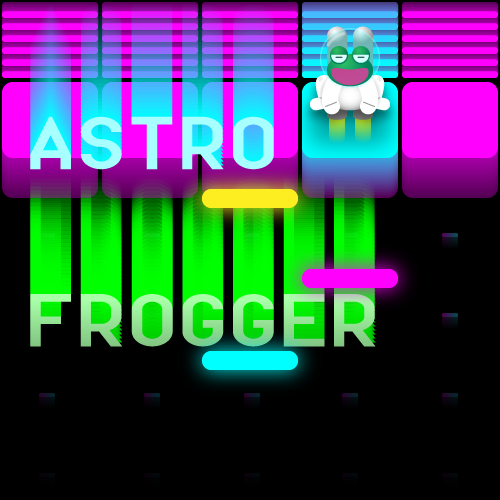
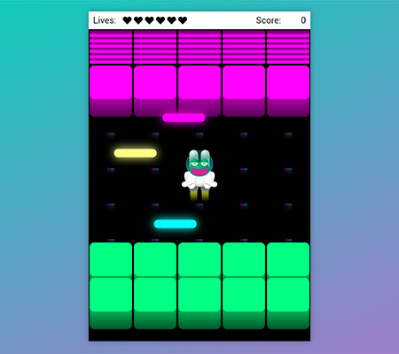

# Classic Arcade Game Clone Project

**Astro Frogger** - Classic Arcade Game Clone

Student Project #4 during Google Front-End Development Nanodegree Program at Udacity

[See live project](https://dominicom.github.io/arcade-game/)

## Table of Contents

* [How to play](#how-to-play)
* [About the project](#about-the-project)
* [Contributing](#contributing)

## How to play
* Open the game [here](https://dominicom.github.io/arcade-game/)
* Handle Frog token with `arrow keys` on keyboard or screen *gamepad* (mobile)
* Avoid enemy lasers - these ones are everywhere
* Get Frog safely to purple platform and score points

#### Screenshots

## About the project
This is #4 student project made for Udacity classroom on Front-End Web Developer track.
The project is a clone of popular in '80 game called **FROGGER**.

#### Starter Project
> link https://github.com/udacity/frontend-nanodegree-arcade-game

The starter project has basic functionality like a Player and Enemies (originally Bugs). The goal of the player is to reach the water, without colliding into any one of the enemies. The player can move left, right, up and down. The enemies move in varying speeds on the paved block portion of the scene. Once a the player collides with an enemy, the game is reset and the player moves back to the start square. Once the player reaches the water the game is won.

#### Project Instructions
The [repository](https://github.com/udacity/frontend-nanodegree-arcade-game) contains css, images, and js folders, as well as an `index.html` and a `README.md` file. Also there is provided and need to edit `app.js`  to build the game.

* The _css_ folder contains a `style.css` file which student do not need to edit
* The *images* folder contains the *png* image files, which are used when displaying the game. The *images* for the player and enemy character are going to be loaded from this folder.
* The js folder also contains the app engine needed to run the game and a resources.js file. You do not need to edit these files.
* opening `index.html` should load the game
* `README.md` should contain instructions on how to load and play the game

Inside the `app.js` file, student need to implement the _Player_ and the _Enemy_ classes, using `Object-Oriented JavaScript`. Part of the code for the _Enemy_ is provided, and it will need to complete the following:

The *Enemy* function, which initiates the *Enemy* by:
* Loading the image by setting `this.sprite` to the appropriate image in the image folder (already provided)
  - Setting the _Enemy_ initial location (need to implement)
  - Setting the *Enemy* speed (need to implement)
* The update method for the _Enemy_
  - Updates the Enemy location (need to implement)
  - Handles collision with the *Player* (need to implement)
* Student can add your own *Enemy* methods as needed

Student also need to implement the *Player* class, and you can use the *Enemy* class as an example on how to get started. At minimum student should implement the following:

* The Player function, which initiates the Player by:
    -   Loading the image by setting this.sprite to the appropriate image in the image folder (use the code from the Enemy function as an example on how to do that)
    -   Setting the Player initial location
* The update method for the *Player* (can be similar to the one for the Enemy)
* The render method for the *Player* (can be used the code from the render method for the _Enemy_)
*  The handleInput method, which should receive user input, `allowedKeys` (the key which was pressed) and move the player according to that input. In particular:
    -   Left key should move the player to the left, right key to the right, up should move the player up and down should move the player down.
    -   Recall that the player cannot move off screen (need to check for that and handle appropriately).
    -   If the player reaches the water the game should be reset by moving the player back to the initial location (can be written as separate reset _Player_ method to handle that).
* Student can add own _Player_ methods as needed.

Once you have completed implementing the *Player* and *Enemy*, you should instantiate them by:

-   Creating a new Player object
-   Creating several new Enemies objects and placing them in an array called allEnemies

#### Graphics and design resources

Original graphic design and assets by the [Author](https://www.kiepuszewski.com).

#### External libraries Used

* jQuery
* Simple solution for detecting mobile browser from `Facebook Slingshot`
> Source: [Stack Overflow](https://stackoverflow.com/questions/11381673/detecting-a-mobile-browser)
>
>`var isMobile = /iPhone|iPad|iPod|Android/i.test(navigator.userAgent);`
> `if (isMobile) {`
> `}`

## Contributing

This repository is the starter code for _all_ Udacity students. Therefore, we most likely will not accept pull requests.

For details, check out [CONTRIBUTING.md](CONTRIBUTING.md).
